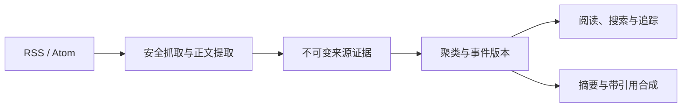

# Reader

Reader 是一个面向个人使用的自托管信息阅读器，把持续到达的 RSS 内容整理成可阅读、可搜索、可追踪的事件流。

## 核心能力

- 将相似报道聚合为 Event，同时保留每个来源的原始证据。
- 生成单篇摘要、带引用的多来源合成稿和日 / 周 / 月报告。
- 提供全文阅读、翻译、搜索、主题追踪、过滤和阅读状态。
- 支持本地模型与 OpenAI-compatible HTTP API；私密来源始终只允许本地处理。



## 技术栈

- Web：Next.js
- API：FastAPI
- 数据库：PostgreSQL + pgvector
- 队列：Redis Queue

## 本地检查

```sh
python3 -m venv .venv
.venv/bin/pip install -r apps/api/requirements.txt
npm install
.venv/bin/pytest apps/api
npm run web:test
npm run web:typecheck
```

## 自托管

从 [`.env.example`](./.env.example) 创建本地 `.env`，至少设置随机的 `READER_API_TOKEN`，然后运行：

```sh
docker compose up --build
```

默认入口为 `http://127.0.0.1:3007`。模型地址、模型名和缓存上限均可通过 `.env` 调整；真实密钥和私有地址不要提交到 Git。

进一步了解：[产品说明](./docs/PRODUCT.md) · [系统架构](./docs/ARCHITECTURE.md) · [版本记录](./VERSIONS.md)

## License

Copyright © 2026 soso-li. All rights reserved.
